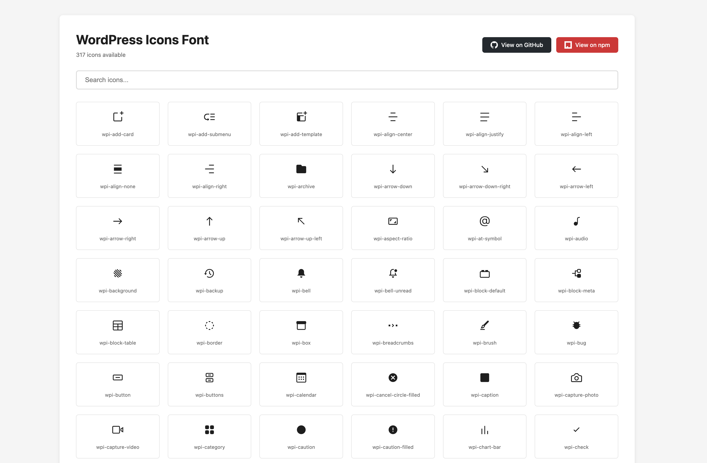
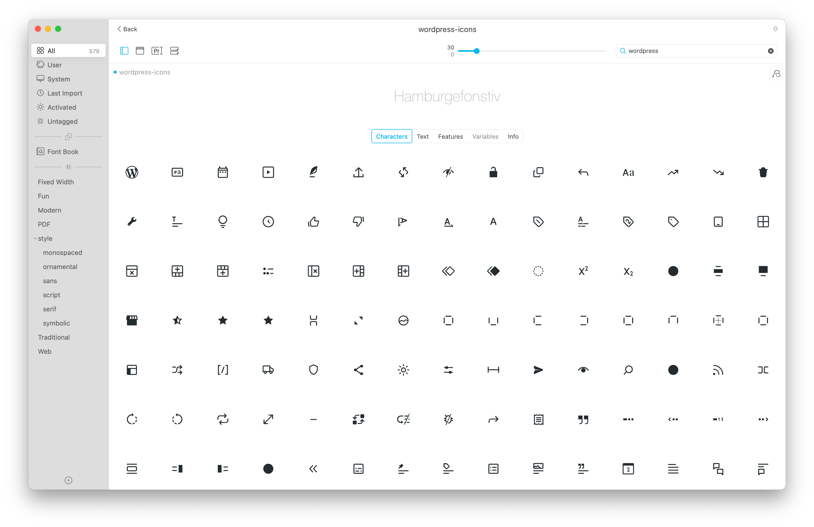

# WordPress Icons Font

Convert WordPress icons from the `@wordpress/icons` package into a custom icon font.

**Icons by:** [WordPress Design Team](https://github.com/WordPress/gutenberg/tree/trunk/packages/icons)
**Font Conversion Tool by:** [DPlugins](https://dplugins.com)

## Features

- Extracts all 317 WordPress icons from React/JSX components
- Generates web font files (WOFF2, WOFF, TTF, EOT)
- Includes CSS stylesheet with icon classes
- Interactive HTML preview page with search functionality
- One-click icon class name copying
- CSS variables for easy customization
- Separate stylesheet for preview page styling

## Installation

```bash
npm install
```

## Usage

### Generate the Font

```bash
npm run generate
```

This will:
1. Extract SVG data from WordPress icon JavaScript modules
2. Clean and optimize the SVG files
3. Generate font files in the `dist/` directory
4. Create an interactive preview at `index.html`

### Preview Icons

Open `index.html` in your browser to see all available icons. You can:
- Search for icons by name
- Click any icon to copy its class name
- View all 317 icons in a grid layout
- Access GitHub and npm links directly from the header
- Download fonts directly via the "Download Fonts" button

#### HTML Preview



#### Typeface Font App Preview



### Use in Your Project

1. Copy the `dist/` folder to your project
2. Include the CSS file in your HTML:

```html
<link rel="stylesheet" href="dist/wordpress-icons.css">
```

3. Use icons with the `wpi-` prefix:

```html
<i class="wpi wpi-add-card"></i>
<i class="wpi wpi-arrow-down"></i>
<i class="wpi wpi-admin-users"></i>
<i class="wpi wpi-block-default"></i>
```

## Generated Files

- `dist/wordpress-icons.woff2` - Modern web font (best compression)
- `dist/wordpress-icons.woff` - Web font format
- `dist/wordpress-icons.ttf` - TrueType font
- `dist/wordpress-icons.eot` - For older IE browsers
- `dist/wordpress-icons.css` - Stylesheet with icon classes
- `dist/wordpress-icons.json` - Icon name to codepoint mapping
- `index.html` - Interactive preview page
- `preview.css` - Preview page styles with CSS variables

## Customization

### Font Generation

You can modify `index.js` to:
- Change the font name (currently `wordpress-icons`)
- Change the CSS prefix (currently `wpi-`)
- Adjust font height and normalization settings
- Customize which font formats to generate


Simply override these variables in your own CSS to customize the preview page appearance.

## How It Works

1. Reads JavaScript modules from `node_modules/@wordpress/icons/build/library/`
2. Extracts SVG viewBox and path data using regex
3. Reconstructs clean SVG files
4. Optimizes SVGs using SVGO
5. Converts SVGs to font files using Fantasticon
6. Generates CSS and HTML preview

## Requirements

- Node.js 14+
- npm or yarn

## Credits

**Icons:** All icons are created and maintained by the [WordPress Design Team](https://github.com/WordPress/gutenberg/tree/trunk/packages/icons). These icons are part of the official WordPress Gutenberg project.

**Font Conversion Tool:** Created by [DPlugins](https://dplugins.com) - Converting WordPress icons from React components to web fonts.

## License

ISC

The original WordPress icons are licensed under GPLv2 or later by the WordPress contributors.
